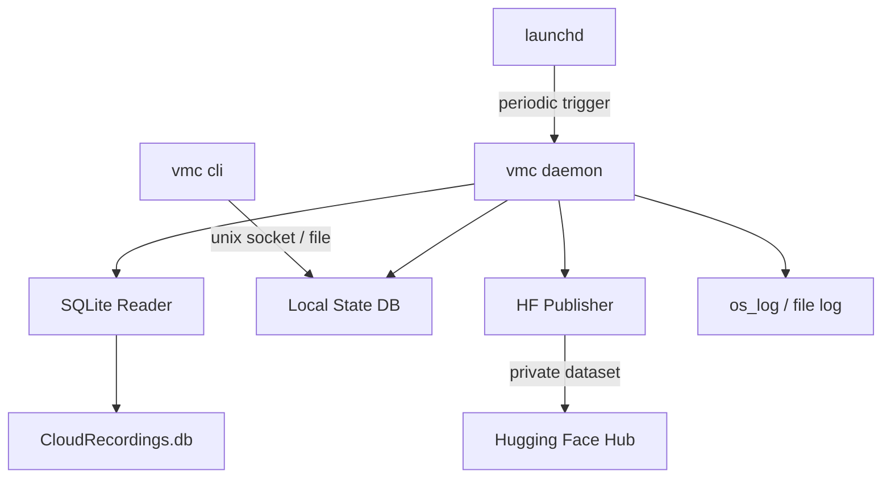
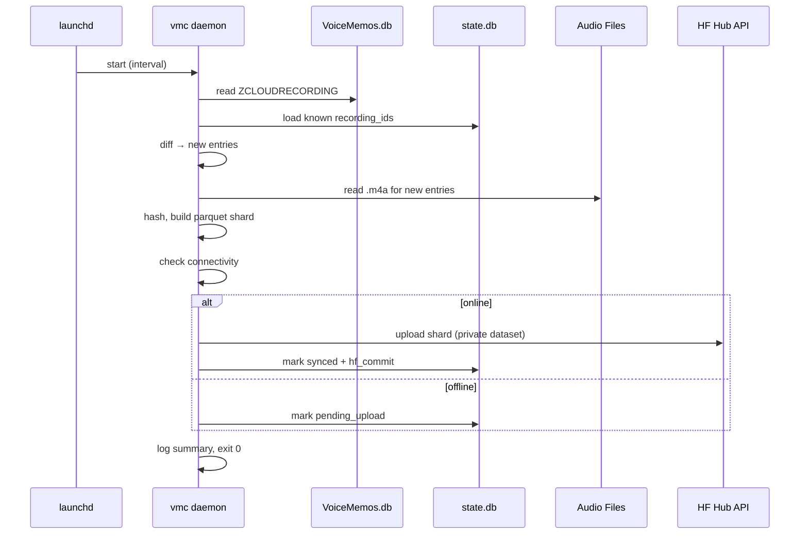

# ADR-00: Voice Memories Curator — High-Level Design

**Status:** Accepted  
**Date:** 2026-06-21  
**Context:** Need a macOS daemon to periodically extract Voice Memos and publish to a private Hugging Face dataset.

---

## Architecture Overview

## Components

### 1. Single Go Binary (`vmc`)

One binary, two modes:
- `vmc daemon` — long-running sync loop (launched by launchd)
- `vmc status` / `vmc logs` / `vmc sync-now` — CLI subcommands that query daemon state

### 2. Data Source: macOS Voice Memos SQLite

- Path: `~/Library/Application Support/com.apple.voicememos/Recordings/CloudRecordings.db`
- Read-only access (open with `SQLITE_OPEN_READONLY`)
- Tables: `ZCLOUDRECORDING` (metadata), audio files on disk as `.m4a`
- Requires **Full Disk Access** TCC permission

### 3. Metadata Collected Per Memory

| Field | Source |
|-------|--------|
| audio (m4a bytes) | filesystem path from `ZPATH` |
| title | `ZCUSTOMLABEL` / `ZENCRYPTEDTITLE` |
| created_at | `ZDATE` (Apple epoch → RFC3339) |
| duration_seconds | `ZDURATION` |
| transcription | Apple on-device transcription if present in DB |
| latitude / longitude | `ZLOCATION` fields if available |
| place_name | reverse-geocoded label if stored |
| device | originating device identifier |
| folder | Voice Memos folder/group |
| recording_id | unique stable ID for dedup |

### 4. Deduplication Strategy

- Local state DB (SQLite, `~/.local/share/vmc/state.db`) tracks:
  - `recording_id` (primary key from Voice Memos DB)
  - `content_hash` (SHA-256 of audio file)
  - `synced_at` timestamp
  - `hf_commit` (commit SHA on HF when pushed)
- On each run: query Voice Memos DB, diff against state DB, only process new/modified entries
- Deleted memos: optionally mark as tombstoned in state, never delete from HF dataset

### 5. HF Publishing

- Use HF Hub HTTP API directly from Go (no Python dependency)
- Dataset visibility controlled via config (default: `private`)
- Push strategy: append-only Parquet shards (one shard per sync batch)
- Each shard is a standalone Parquet file with the schema above
- Repo name configurable via config

### 6. Configuration

- Config file at `~/.config/vmc/config.toml`
- All settings in one place:

| Key | Default | Description |
|-----|---------|-------------|
| `hf_token` | `""` (falls back to `~/.cache/huggingface/token` or `HF_TOKEN` env) | HF API token |
| `hf_repo` | `voice-memories` | Dataset repo name on HF Hub |
| `hf_private` | `true` | Dataset visibility (private by default) |
| `sync_interval` | `3600` | Seconds between syncs (used in launchd plist) |
| `log_level` | `info` | Logging verbosity |
| `state_dir` | `~/.local/share/vmc` | Where state.db and staged shards live |

### 6. Offline Resilience

- Before any network call: probe connectivity (HEAD request to `huggingface.co`)
- If offline: extract and stage locally, mark as `pending_upload` in state DB
- Next online run: batch-upload all pending entries
- Never block, never retry indefinitely — log and exit cleanly

### 7. launchd Integration

- Plist at `~/Library/LaunchAgents/com.vmc.daemon.plist`
- `StartInterval`: configurable (default 3600s = hourly)
- `StandardOutPath` / `StandardErrorPath` → `~/Library/Logs/vmc/`
- `KeepAlive: false` (run-and-exit per interval, not persistent)
- Binary installed at `/usr/local/bin/vmc`

### 8. Logging

- Structured JSON logs to `~/Library/Logs/vmc/vmc.log`
- Log rotation: by size (10MB) with 5 kept
- Levels: `info`, `warn`, `error`
- CLI `vmc logs` tails the log file with optional `--follow`

### 9. CLI Subcommands

| Command | Action |
|---------|--------|
| `vmc status` | show last sync time, pending count, online/offline, dataset URL |
| `vmc sync-now` | trigger immediate sync (same logic as daemon run) |
| `vmc logs` | tail log output |
| `vmc install` | write launchd plist + load agent |
| `vmc uninstall` | unload agent + remove plist |

### 10. Go Dependencies (minimal)

- `modernc.org/sqlite` — pure-Go SQLite (no CGO, single binary)
- `parquet-go` — Parquet file writing
- Standard library for HTTP (HF API), JSON, crypto/sha256
- No frameworks for CLI — just `flag` or a thin wrapper

## Data Flow Per Sync Cycle

## Security / Privacy Notes

- Dataset hardcoded to **private** — no flag to make public
- HF token stored in standard HF location (user's responsibility)
- No audio data cached outside state DB + HF — staged parquet in temp dir, cleaned after upload
- Full Disk Access required — user grants once via System Settings

## Build / Distribution

- Single `go build` produces static binary
- No CGO (pure-Go SQLite) — trivially cross-compilable but only targets `darwin/arm64`
- Homebrew tap or direct download
