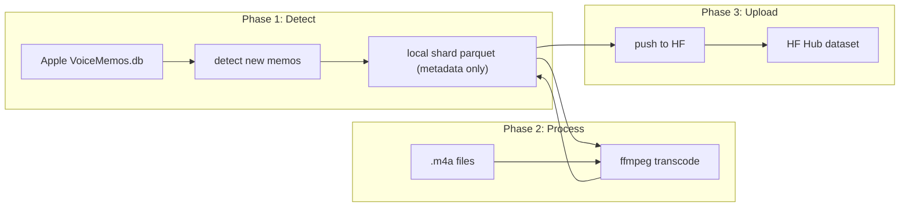
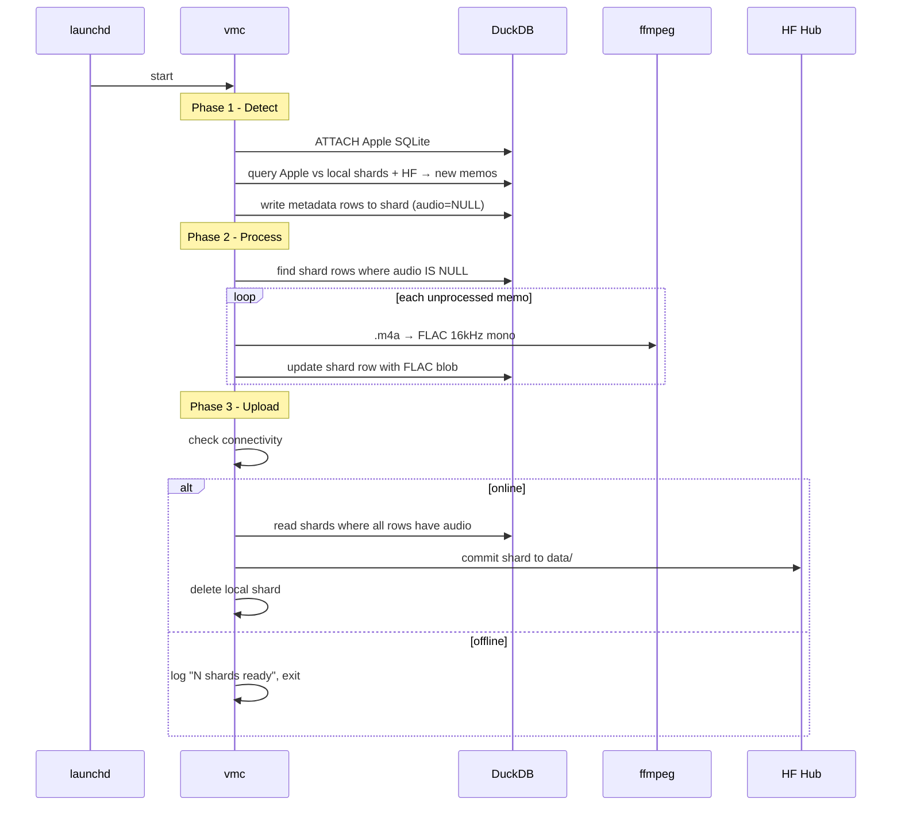

# ADR-00: Voice Memories Curator — High-Level Design

**Status:** Accepted  
**Date:** 2026-06-21  
**Context:** Need a macOS daemon to periodically extract Voice Memos and publish to a private Hugging Face dataset.

---

## Architecture Overview

Three decoupled phases, each runs independently:



## Design Principles

1. **Three independent phases** — detect, process, upload. Each does one job. They don't depend on each other running in the same pass.
2. **HF is the permanent store** — once uploaded, local shards can be cleaned.
3. **Self-contained dataset** — Parquet shards on HF embed FLAC audio blobs. Download the dataset, get everything.
4. **Incremental** — each sync appends a new shard to the HF repo.
5. **Lazy** — if offline, detect still works. Processing still works. Only upload waits.

## The Three Phases

### Phase 1: Detect

Find new/modified memos in Apple's DB. Append metadata rows to local Parquet shard. No audio processing.

- Attach Apple's SQLite via DuckDB
- Query Apple DB against existing local shards + HF remote to find what's new/changed
- Write metadata-only rows to the current local shard (recording_id, title, timestamps, location, transcription, audio_path reference)
- Runs regardless of connectivity (offline: skip HF query, check local shards only)

### Phase 2: Process

Fill the audio column for detected entries that don't have it yet.

- Read local shard, find rows where audio blob is NULL
- For each: invoke `ffmpeg` to transcode `.m4a` → FLAC 16kHz mono
- Write FLAC bytes into the shard's audio column
- Runs regardless of connectivity

### Phase 3: Upload

Push fully processed shards to HF.

- Check connectivity
- If offline: exit
- If online: find shards where all rows have non-NULL audio
- Commit shard to HF dataset repo as `data/shard_NNNN.parquet`
- On success: optionally delete local shard

## Components

### 1. Single Go Binary (`vmc`)

One binary, subcommands:
- `vmc daemon` — runs all three phases in sequence (launched by launchd)
- `vmc detect` — run phase 1 only
- `vmc process` — run phase 2 only
- `vmc upload` — run phase 3 only
- `vmc status` / `vmc logs` — query pipeline state from shards
- `vmc install` / `vmc uninstall` — launchd management

### 2. DuckDB Engine

Single dependency:
- Attaches Apple's SQLite read-only (`sqlite_scanner`)
- Reads/writes local Parquet shards (native Parquet support)
- Queries HF remote Parquet when online (for dedup in phase 1)

Requires CGO (`github.com/marcboeker/go-duckdb`). Binary ~80MB.

### 3. Data Source: macOS Voice Memos

- Path: `~/Library/Application Support/com.apple.voicememos/Recordings/CloudRecordings.db`
- Attached read-only: `ATTACH '...' AS apple (TYPE sqlite, READ_ONLY);`
- Requires **Full Disk Access** TCC permission

### 4. Metadata Collected Per Memory

| Field | Source |
|-------|--------|
| audio | FLAC 16kHz mono blob (filled in phase 2) |
| title | `ZCUSTOMLABEL` / `ZENCRYPTEDTITLE` |
| created_at | `ZDATE` (Apple epoch → RFC3339) |
| duration_seconds | `ZDURATION` |
| transcription | Apple on-device transcription if present in DB |
| latitude / longitude | `ZLOCATION` fields if available |
| place_name | reverse-geocoded label if stored |
| device | originating device identifier |
| folder | Voice Memos folder/group |
| recording_id | unique stable ID for dedup |

### 5. Local Shard Lifecycle

```
[phase 1] create shard, metadata only, audio column = NULL
[phase 2] fill audio column with FLAC blob
[phase 3] upload to HF, then optionally delete local copy
```

Shards live at `~/.local/share/vmc/shards/shard_NNNN.parquet`.

### 6. Configuration

Config file at `~/.config/vmc/config.toml`:

| Key | Default | Description |
|-----|---------|-------------|
| `hf_token` | `""` (falls back to HF cache / env) | HF API token |
| `hf_repo` | `voice-memories` | Dataset repo name |
| `hf_private` | `true` | Dataset visibility |
| `sync_interval` | `3600` | Seconds between runs |
| `log_level` | `info` | Logging verbosity |
| `shard_dir` | `~/.local/share/vmc` | Local shards directory |
| `keep_uploaded_shards` | `false` | Delete local shards after upload |

### 7. Offline Behavior

| Phase | Offline? | Behavior |
|-------|----------|----------|
| Detect | works | reads local Apple DB; skips HF query, checks local shards only |
| Process | works | reads local .m4a files, no network needed |
| Upload | skips | logs "offline, N shards ready", exits |

Heavy local files (shards with audio) only exist between phase 2 and phase 3. Once uploaded, they're gone (if `keep_uploaded_shards = false`).

### 8. launchd Integration

- Plist at `~/Library/LaunchAgents/com.vmc.daemon.plist`
- `StartInterval`: from config (default 3600s)
- `KeepAlive: false` (run all phases, exit)
- Binary at `/usr/local/bin/vmc`

### 9. Logging

- Structured JSON logs to `~/Library/Logs/vmc/vmc.log`
- Rotation: 10MB, 5 kept
- Levels: `info`, `warn`, `error`

### 10. CLI Subcommands

| Command | Action |
|---------|--------|
| `vmc status` | last run, pending/processed counts from shards, online status, dataset URL |
| `vmc daemon` | run detect → process → upload in sequence |
| `vmc detect` | phase 1 only |
| `vmc process` | phase 2 only |
| `vmc upload` | phase 3 only |
| `vmc sync-now` | alias for `vmc daemon` |
| `vmc logs` | tail logs |
| `vmc install` | write + load launchd plist |
| `vmc uninstall` | unload + remove plist |

### 11. Go Dependencies

- `github.com/marcboeker/go-duckdb` — DuckDB (CGO)
- Standard library: `net/http`, `os/exec`, `crypto/sha256`, `encoding/json`
- Runtime dependency: `ffmpeg` (declared in Homebrew formula, pulled automatically)

## Data Flow



## Build / Distribution

- `CGO_ENABLED=1 go build` — target `darwin/arm64` only
- Binary ~80MB (DuckDB embedded)
- Pre-built binary via GitHub releases or Homebrew tap
- Homebrew formula declares `depends_on "ffmpeg"` — installed automatically as a package dependency
